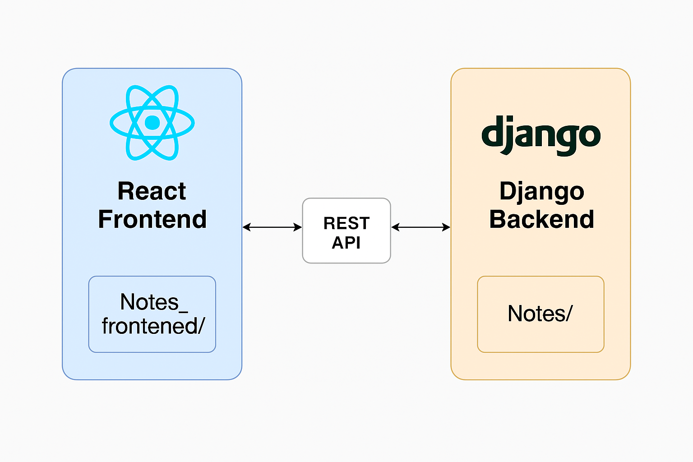

# 📝 React Notes App

A full-stack note-taking application built with **React (Frontend)** and **Django (Backend)**. This app allows users to create, read, update, and delete notes using a clean and modern UI powered by a REST API.

---

## 📸 Architecture Diagram



---

## 🚀 Features

- ✅ CRUD operations on notes
- ⚛️ React frontend with Axios for API communication
- 🌐 Django backend with RESTful endpoints
- 🔄 Cross-Origin communication enabled (CORS)
- 📦 Scalable project structure

---

## 🛠️ Tech Stack

| Layer      | Technology     |
|------------|----------------|
| Frontend   | React.js, Axios |
| Backend    | Django (Python) |
| Database   | SQLite (can be swapped for PostgreSQL) |
| API        | REST (custom built) |
| Others     | CORS Headers |

---

## 📁 Project Structure

```bash
React_notes/
├── notes/               # Django Backend
│   ├── models.py        # Note model
│   ├── views.py         # View logic (API endpoints)
│   ├── urls.py          # URL routing for APIs
│   └── ...
├── notes_frontened/     # React Frontend (suggest renaming to 'frontend')
│   ├── src/
│   └── ...
